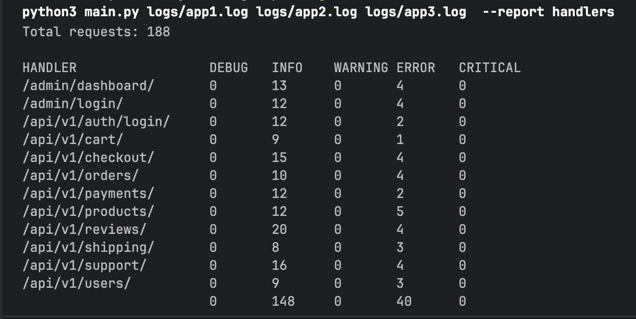

# Анализ журнала логирования

Приложение предназначено для анализа лог-файлов и генерации отчетов на основе полученных данных.
Для обработки данных используется асинхронная обработка, а отчеты создаются в формате текста.
Приложение поддерживает расширяемую систему отчетов, которая позволяет добавлять новые типы отчетов.

## Установка

1. Клонирование репозитория:

   ```bash
   git clone https://github.com/knopa-f1/log_reports
   
2. Установка зависимостей:
    
    ```bash
    pip install -r requirements.txt
   
## Запуск приложения

Запуск приложения осуществляется через консоль. Приложение принимает следующие параметры:

```bash
    python3 main.py log_file.log --report report_name
```

### Параметры:
* files: Список файлов, которые нужно обработать. Укажите путь до файлов через пробел.
* --report или -r: Тип отчета, который нужно сгенерировать. Например, для отчета по обработчикам:
```bash
python main.py logs/file1.log --report handlers
```
* --help или -h: Параметр для вывода справки о доступных параметрах.

### Пример формирования отчета


## Расширение отчетов
Для добавления нового типа отчета, необходимо выполнить следующие шаги:
1. Создать новый класс отчета, который будет наследовать от BaseReport.
2. Реализовать метод build для сбора данных и метод export для генерации отчетов в нужном формате.

Пример добавления нового отчета:
```python
from reports.base_report import BaseReport

class CustomReport(BaseReport):
    def build(self):
        # Сбор данных

    def export(self) -> str:
        # Генерация отчета
        return "Generated Report"
```

## Тестирование
Для тестирования приложения и отчетов используется pytest. Тесты можно запустить следующим образом:
```bash
pytest
```

